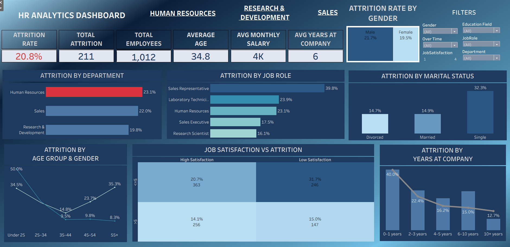

# 👥 HR Analytics Dashboard (Tableau)

An interactive **HR Analytics Dashboard** developed in **Tableau** to analyze employee attrition, workforce demographics, job satisfaction, and employee retention trends. The dashboard provides actionable insights to help HR teams identify key factors influencing employee turnover and make data-driven workforce decisions.

---

## 📊 Dashboard Preview



---

## 🚀 Project Overview

The **HR Analytics Dashboard** transforms employee data into meaningful business insights through interactive visualizations and KPI tracking.

It helps HR professionals monitor attrition patterns, evaluate workforce demographics, identify high-risk employee groups, and develop effective retention strategies.

---

## 📋 Dashboard KPIs

* 👥 Total Employees
* 🚪 Total Attrition
* 📉 Attrition Rate
* 🎂 Average Age
* 💰 Average Monthly Salary
* 🏢 Average Years at Company

---

## 📊 Dashboard Features

### Workforce Overview

* Total Employee Count
* Overall Attrition Rate
* Average Employee Age
* Average Monthly Salary
* Average Years at Company

### Attrition Analysis

* Attrition by Department
* Attrition by Job Role
* Attrition by Gender
* Attrition by Marital Status
* Attrition by Age Group
* Attrition by Years at Company

### Employee Satisfaction Analysis

* Job Satisfaction vs Attrition
* Satisfaction Impact on Employee Retention

### Interactive Filters

* Gender
* Education Field
* Department
* Job Role
* Job Satisfaction
* Overtime Status

---

## 📌 Key Insights

* Human Resources has the highest attrition rate among departments.
* Sales Representatives experience the highest employee turnover among job roles.
* Single employees show significantly higher attrition compared to married and divorced employees.
* Employees with lower job satisfaction are more likely to leave the organization.
* New employees (0–1 years tenure) exhibit the highest attrition rate.
* Attrition is slightly higher among male employees compared to female employees.

---

## 🛠 Tools & Technologies Used

* Tableau
* Microsoft Excel
* Data Cleaning & Transformation
* Calculated Fields
* Interactive Filters
* Dashboard Design
* Data Visualization
* Business Intelligence

---

## 📂 Repository Structure

```text
HR-Analytics-Dashboard/
│
├── Dashboard.png
├── HR-Employee-Attrition.csv
├── README.md
```

---

## 📊 Dashboard Components

* KPI Cards
* Horizontal Bar Charts
* Line Charts
* Treemap Visualization
* Interactive Filters
* Workforce Metrics
* Employee Satisfaction Analysis

---

## 📈 Metrics Tracked

| Metric                   | Description                          |
| ------------------------ | ------------------------------------ |
| Total Employees          | Total workforce count                |
| Total Attrition          | Total employees who left the company |
| Attrition Rate           | Percentage of employee turnover      |
| Average Age              | Average age of employees             |
| Average Monthly Salary   | Average employee monthly salary      |
| Average Years at Company | Average employee tenure              |
| Job Satisfaction         | Employee satisfaction level          |
| Department Attrition     | Attrition rate across departments    |
| Job Role Attrition       | Attrition rate across job roles      |

---

## 🎯 Business Value

This dashboard enables organizations to:

* Identify high attrition departments and job roles
* Improve employee retention strategies
* Understand workforce demographics
* Monitor employee satisfaction levels
* Analyze turnover trends
* Support HR decision-making with data-driven insights
* Reduce recruitment and replacement costs

---

## 📌 Skills Demonstrated

* Tableau Dashboard Development
* HR Analytics
* Data Cleaning & Preparation
* KPI Reporting
* Data Visualization
* Workforce Analytics
* Business Intelligence
* Interactive Dashboard Design
* Insight Generation

---

## 👩‍💻 Author

**Parvathy S**

**Data Analyst | Tableaul**

---

